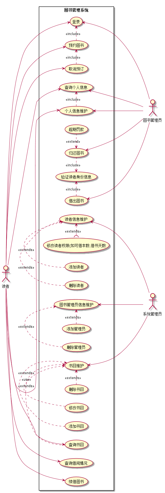
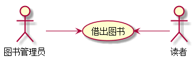
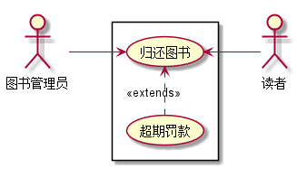
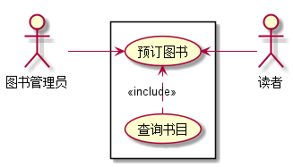

# 实验2：图书管理系统用例建模
|    学号  |   班级    |    姓名  |   照片     |
|:--------:|:--------: | :----------: | :-------:|
|201510414430|软件(本)15-4|周威 ||

## 1. 图书管理系统的用例关系图

### 1.1 用例图PlantUML源码如下：

<pre>
@startuml

left to right direction
:系统管理员: as SystemAdmin
:图书管理员: as Admin
:读者: as User

rectangle 图书管理系统{
User --> (登录)
User --> (个人信息维护)
User --> (查询个人信息)
User --> (查询借阅情况)
User --> (预约图书)
User --> (取消预订)
(预约图书).>(登录):<<include>>
(取消预订).>(预约图书):<<include>>
(个人信息维护).>(查询个人信息):<<include>>
User --> (续借图书)
User --> (查询书目)

(借出图书).>(验证读者身份信息):<<include>>
(借出图书) <-  Admin
(个人信息维护) <-  Admin
(查询个人信息) <-  Admin
(验证读者身份信息)<.(归还图书):<<include>>
(归还图书)<.(超期罚款):<<extend>>
(归还图书) <- Admin
(登录)<--- Admin

(读者信息维护) <- SystemAdmin
(添加读者).>(读者信息维护):<<extends>>
(删除读者).>(读者信息维护):<<extends>>
(修改读者权限(如可借本数,借书天数)).>(读者信息维护):<<extends>>
(图书管理员信息维护) <- SystemAdmin
(添加管理员).>(图书管理员信息维护):<<extends>>
(删除管理员).>(图书管理员信息维护):<<extends>>
(书目维护) <--- SystemAdmin
(删除书目).>(书目维护):<<extends>>
(修改书目).>(书目维护):<<extends>>
(添加书目).>(书目维护):<<extends>>
(查询书目).>(书目维护):<<use>>
}

@enduml
</pre>

### 1.2. 用例图如下：

## 2. 参与者说明：

###     2.1 图书管理员

主要职责是：主要负责对读者的借书和还书进行业务处理，协助收取逾期还书者的费用；对图书进行分类整理；处理其他与图书馆正常运行相关的事物以及个人信息的查询与维护。

###     2.2 读者

主要职责是：通过注册登录系统后，可以实现查询书目，预订图书，取消预订，借书，还书，续借图书，个人信息的查询与维护以及查询借阅情况。

###     2.3 系统管理员
    
主要职责是：负责对读者，管理员以及图书的管理。包括对读者，图书管理员和图书的添加，删除等。

##     3. 用例规约表

###     3.1 “借出图书”用例

|Title | 内容 |
|:------:|:------:|
|用例名称|借出图书  
|参与者|图书管理员、读者|
|前置条件|图书管理员已登录到系统且读者信息审核通过|
|后置条件|产生借出记录并记录到系统数据库|
|主事件流|1.图书管理员验证读者身份信息； 2.图书管理员查询被借图书是否已被人预约； 3.图书管理员使用扫描仪扫描并借出此书； 4.系统修改本书的状态以及库存同时也修改当前读者的已借书量以及记录借书时间； 5.借书完成。|

***3.1.1 “借出图书”用例流程图源码如下：***

<pre>
@startuml
:图书管理员: as Librarian
:读者: as Reader
left to right direction
Librarian -->(借出图书)
(借出图书) <--Reader
@enduml
</pre>

***3.1.2 “借出图书”用例流程图如下：***

###     3.2 “归还图书”用例
|Title | 内容 |
|:------:|:------:|
|用例名称|归还图书  
|参与者|图书管理员、读者|
|前置条件|图书管理员已登录到系统|
|后置条件|产生归还记录并记录到系统数据库|
|主事件流|1.图书管理员验证读者身份信息和图书信息； 2.管理员通过扫面议扫描消除本书当前的状态； 3.系统更改本书的库存并将图书当前状态记录到数据库； 4.系统检测当前书是否是逾期归还若是产生逾期费用； 5.读者缴纳逾期费用; 6.还书完成。|

***3.2.1 “归还图书”用例流程图源码如下：***

<pre>
@startuml
:图书管理员: as Librarian
:读者: as Reader
left to right direction
rectangle {
Librarian -->(归还图书)
(超期罚款).>(归还图书):<<extends>>
(归还图书) <--Reader
}
@enduml
</pre>

***3.2.2 “归还图书”用例流程图如下：***

###     3.3 “预订图书”用例
|Title | 内容 |
|:------:|:------:|
|用例名称|预订图书  
|参与者|读者|
|前置条件|读者已登录到系统|
|后置条件|产生预订信息并记录到系统数据库|
|主事件流|1.读者登录系统； 2.查询书目当前库存； 3.提交预订请求； 4.系统审核通诺； 5.预订通过。|

***3.3.1 “预订图书”用例流程图源码如下：***

<pre>
@startuml
:图书管理员: as Librarian
:读者: as Reader
left to right direction
rectangle {
Librarian -->(预订图书)
(查询书目).>(预订图书):<<include>>
(预订图书) <--Reader
}
@enduml
</pre>

***3.3.2 “预订图书”用例流程图如下：***

