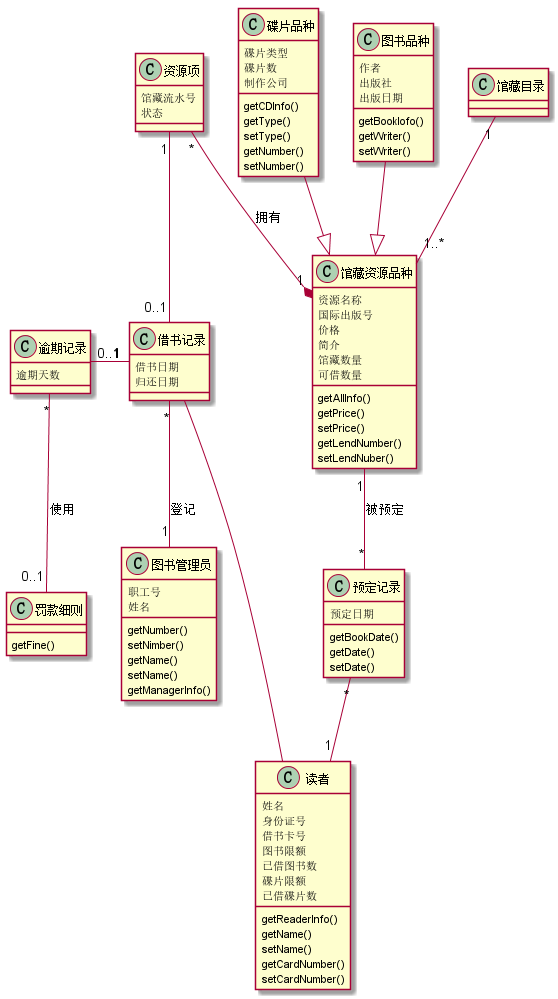
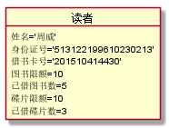
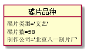
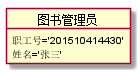

# 实验3：图书管理系统领域对象建模
|    学号  |   班级    |    姓名  |   照片     |
|:--------:|:--------: | :----------: | :-------:|
|201510414430|软件(本)15-4|周威 ||

## 1. 图书管理系统的类图

### 1.1 类图PlantUML源码如下：

<pre>

@startuml
class 馆藏目录{

}
class 馆藏资源品种{
  资源名称
  国际出版号
  价格
  简介
  馆藏数量
  可借数量
  getAllInfo()
  getPrice()
  setPrice()
  getLendNumber()
  setLendNuber()
}
class 资源项{
  馆藏流水号
  状态
}
class 预定记录{
 预定日期
 getBookDate()
 getDate()
 setDate()
}
class 碟片品种{
  碟片类型
  碟片数
  制作公司
  getCDInfo()
  getType()
  setType()
  getNumber()
  setNumber()
}
class 图书品种{
  作者
  出版社
  出版日期
  getBookIofo()
  getWriter()
  setWriter()
}
class 借书记录{
 借书日期
 归还日期
}
class 读者{
  姓名
  身份证号
  借书卡号
  图书限额
  已借图书数
  碟片限额
  已借碟片数
  getReaderInfo()
  getName()
  setName()
  getCardNumber()
  setCardNumber()
}
class 图书管理员{
  职工号
  姓名
  getNumber()
  setNimber()
  getName()
  setName()
 getManagerInfo()
}
class 逾期记录{
  逾期天数
}
class 罚款细则{
     getFine()

}

馆藏目录 "1"--"1..*" 馆藏资源品种
馆藏资源品种 "1"--"*" 预定记录:被预定
资源项 "*"--*"1" 馆藏资源品种:拥有
预定记录 "*"--"1" 读者
碟片品种 --|> 馆藏资源品种
图书品种 --|> 馆藏资源品种
借书记录 "*"--"1" 图书管理员:登记
逾期记录 "0..1"-"1" 借书记录
资源项 "1"--"0..1" 借书记录
借书记录 -- 读者
逾期记录 "*"--"0..1" 罚款细则:使用
@enduml
</pre>

### 1.2. 类图如下：

### 1.3 类图说明：
  本系统主要的类是图书品种、碟片品种、馆藏资源品种、借书记录、预订记录、图书管理员和读者等。其中不同的类之间存在着不同的关系。一个馆藏目录可以拥有一个或者多个馆藏资源品种；一个馆藏资源品种可以拥有一个或者多个资源项；馆藏资源品种又可以是碟片或者图书；一个图书管理员可以登记一条或者多条借书记录；一个读者也可以产生一条或者多条预订记录等。通过类图可以清晰的看出项目开发中需要用到的类以及各个类之间的关系，理清了项目开发的思路。

## 2. 图书管理系统的对象图：

###    2.1 类 【读者】 的对象图
####    源码如下：
<pre>
@startuml

object 读者{
  姓名='周威'
  身份证号='513122199610230213'
  借书卡号='201510414430'
  图书限额=10
  已借图书数=5
  碟片限额=10
  已借碟片数=3
}

@enduml
</pre>

####    对象图如下：

###    2.2 类 【碟片品种】 的对象图
####    源码如下：
<pre>
@startuml

object 碟片品种{
 碟片类型='文艺'
 碟片数=58
 制作公司='北京八一制片厂'
}

@enduml
</pre>

####    对象图如下：

###    2.3 类 【图书品种】 的对象图
####    源码如下：
<pre>
@startuml

object 图书品种{
 作者='余华'
 出版社='浙江大学出版社'
 出版日期=2016/8/5
}

@enduml
</pre>

####    对象图如下：

###    2.4 类 【图书管理员】 的对象图
####    源码如下：
<pre>
@startuml

object 图书管理员{
职工号='201510414430'
姓名='张三'

@enduml
</pre>

####    对象图如下：

###    2.5 类 【借书记录】 的对象图
####    源码如下：
<pre>
@startuml

object 借书记录{
 借书日期=2018/03/05
 归还日期=2018/04/15
}

@enduml
</pre>

####    对象图如下：

 
###    2.5 类 【预订记录】 的对象图
####    源码如下：
<pre>
@startuml

object 预订记录{
预订日期=2018/4/12
}

@enduml
</pre>

####    对象图如下：

      
    
    
