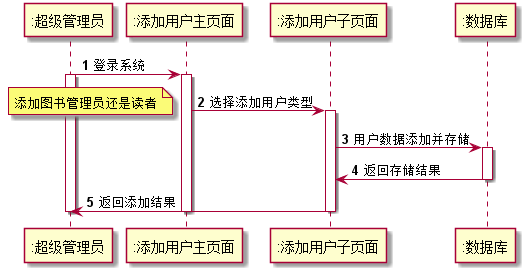

# 实验4：图书管理系统顺序图绘制
|    学号  |   班级    |    姓名  |   照片     |
|:--------:|:--------: | :----------: | :-------:|
|201510414430|软件(本)15-4|周威 ||

## 1. 图书管理员处理借书

### 1.1 图书管理员处理借书PlantUML源码：

<pre>

@startuml
        autonumber
        actor ":图书管理员" as admin
        participant ":读者" as reader
        participant ":资源项" as resource
        participant ":馆藏资源品种" as variety
        participant ":借书记录" as record

        admin -> reader:验证读者
        activate admin
        activate reader
        deactivate reader

        admin -> reader:取读者限额
        activate reader
        deactivate reader

       loop
       admin -> resource:获取资源项
       activate resource

       resource -> variety:查找资源品种
       activate variety
       deactivate variety
       deactivate resource

       admin -> record:创建借书记录
       activate record
       deactivate record

       admin -> resource:借出资源
       activate resource

       resource -> variety:减少可借数量
       activate variety
       deactivate variety
       deactivate resource

       admin -> reader:减少可用限额
       activate reader
       deactivate reader

       end

      admin -> record:打印借书清单
      activate record
      deactivate record
      deactivate admin

@enduml
</pre>

### 1.2. 图书管理员处理借书顺序图如下：

### 1.3 图书管理员处理借书顺序图说明：
  读者刷读书卡登录后，图书管理员先验证读者的身份以及可借的额度然后在系统中查找需借书目的相关信息并且将该书借给读者，同时创建借书记录，减少该书的可借数量以及该读者的可借额度，最后打印借书清单。

## 2. 图书管理员处理还书：

###    2.1 图书管理员处理还书PlantUML源码：

<pre>
@startuml
        autonumber
        actor ":图书管理员" as admin
        participant ":资源项" as resource
        participant ":借书记录" as record
        participant ":馆藏资源品种" as variety
        participant ":读者" as reader
        participant ":逾期记录" as overdue

        admin -> resource:读取资源信息
        activate admin
        activate resource

        resource -> record: 取借书记录
        activate record
        deactivate record

        resource -> variety:取资源的品种
        activate variety
        deactivate variety
        deactivate resource

        admin -> reader: 取借阅者信息
        activate reader
        deactivate reader

        admin -> resource:归还资源
        activate resource

        resource -> variety: 增加可借数量
        activate variety
        deactivate resource
        deactivate variety

        admin -> record:登记还书日期
        activate record
        deactivate record

        opt 逾期
        admin -> overdue:登记逾期记录
        activate overdue

        overdue -> reader:生成缴费单
        activate reader

        deactivate overdue

        reader -> admin:缴纳费用
        deactivate reader
        end

        deactivate admin

@enduml
</pre>

###   2.2 图书管理员处理还书顺序图如下：

### 2.3 图书管理员处理还书顺序图说明：
   图书管理员先检查读者所还书籍的资源信息(验证是否是图书馆里面的书等)，对照借书记录和借阅者信息审查，接着归还书籍同时增加所还图书的可借数量同时记录归还日期，最后审查归还日期是否逾期，如果是将生成缴费单并告知读者进行缴费。

## 3. 读者预订图书：

###    3.1 读者预订图书PlantUML源码：
<pre>
@startuml
        autonumber
        actor ":读者" as reader
        participant ":预订页面" as orderwindow
        participant ":资源项" as resource
        participant ":馆藏资源品种" as variety
        participant ":预订信息" as orderinfo

        reader -> orderwindow:登录系统
        activate reader
        activate orderwindow

        orderwindow -> resource:搜索预订书目
        activate resource
        deactivate orderwindow

        resource ->variety:查找资源品种
        activate variety
        deactivate resource
        deactivate variety

        reader ->orderinfo:生成预订信息
        activate orderinfo
        deactivate orderinfo

        orderwindow -> reader:减少可预订量
        activate orderwindow
        deactivate orderwindow
        deactivate reader

@enduml
</pre>

###    3.2 读者预订图书顺序图如下：

###    3.3 读者预订图书顺序图说明：
   读者登录系统成功后在预订页面搜索框内输入想预订图书的书名进行书名，并在返回的结果中进行预订，预订成功后将生成预订信息并将该读者的可预订量减少。

## 4. 读者维护信息：

###    4.1 读者维护信息PlantUML源码：
<pre>
@startuml
 autonumber
        actor ":读者" as reader
        participant ":信息维护页面" as maintain
        participant ":超级管理员" as superadmin

       reader -> maintain:登录系统
       activate reader
       activate maintain

       maintain ->maintain:进行信息维护

       maintain -> superadmin:超级管理员审核
       activate superadmin

       superadmin -> maintain:返回结果
       deactivate superadmin

       maintain ->reader:修改成功/失败

       deactivate maintain
       deactivate reader

@enduml
</pre>

###    4.2 读者维护信息顺序图如下：

###    4.3 读者维护信息说明：
  读者登录系统后在信息维护页面进行信息的编辑并保存提交给超级管理员审核，超级管理员检查信息的安全性以及合法性后返回审核结果，信息维护页面把结果显示给读者。
	
## 5. 超级管理员添加用户：

###    5.1 超级管理员添加用户PlantUML源码：
<pre>
@startuml
 autonumber

       participant ":超级管理员" as superadmin
       participant ":添加用户主页面" as addfather
       participant ":添加用户子页面" as addchild
       participant ":数据库" as database

       superadmin -> addfather:登录系统
       activate superadmin
       activate addfather

       addfather -> addchild:选择添加用户类型
       note left:添加图书管理员还是读者
       activate addchild

       addchild -> database:用户数据添加并存储
       activate database

       database ->addchild:返回存储结果
       deactivate database
       addchild ->superadmin:返回添加结果
       deactivate addchild
       deactivate addfather
       deactivate superadmin

@enduml
</pre>

###    5.2 超级管理员添加用户顺序图如下：

###    5.3 超级管理员添加用户顺序图说明：
  超级管理员登录系统后在主添加用户页面选择需要添加的用户类型并跳转到子添加页面，输入相关的用户信息并保存到数据库，最后在子添加页面显示添加结果。
