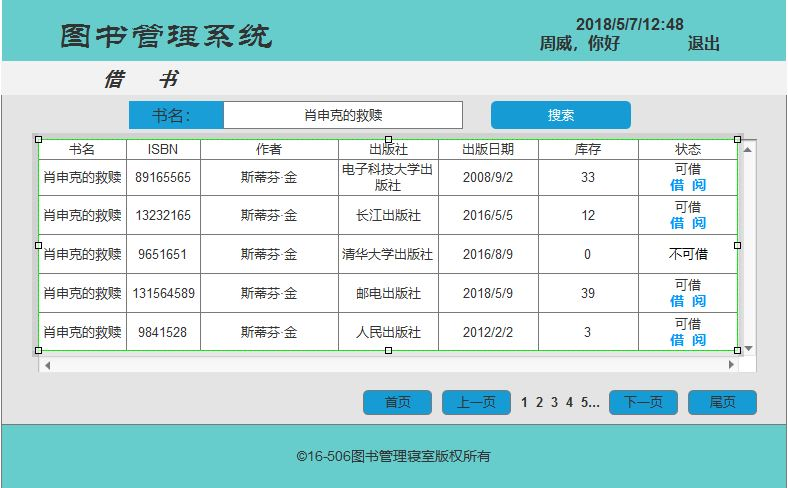

# 实验5：图书管理系统数据库设计与界面设计
|    学号  |   班级    |    姓名  |   照片     |
|:--------:|:--------: | :----------: | :-------:|
|201510414430|软件(本)15-4|周威 ||

## 1.数据库表设计

### 1.1. 图书表
|字段|类型|主键，外键|可以为空|默认值|约束|说明|
|:-------:|:-------------:|:------:|:----:|:---:|:----:|:-----|
|ISBN|varchar(100)|主键|否|||为识别图书而设计的国际编号|
|Name|varchar(30)| |否||||
|Author|varchar(30)| |否||||
|PublishHouse|varchar(100)| |否|||出版社|
|PublishDate|date| |是|||出版日期|
|Type|varchar(20)| |是|||图书类型|
|Price|float| |否||||
|Repertory|int| |否|||库存|
|Gross|int| |否|||图书馆购买总量|
|CanLend|boolean| |否|||是否可借|

### 1.2. 读者表
|字段|类型|主键，外键|可以为空|默认值|约束|说明|
|:-------:|:-------------:|:------:|:----:|:---:|:----:|:-----|
|ReaderID|varchar(30)|主键|否||||
|Name|varchar(30)| |否||||
|Password|varchar(30)| |否||||
|AlreadyLend|int| |否|||该读者已借书量|

### 1.3. 管理员表
|字段|类型|主键，外键|可以为空|默认值|约束|说明|
|:-------:|:-------------:|:------:|:----:|:---:|:----:|:-----|
|AdminID|varchar(30)|主键|否||||
|Name|varchar(30)| |否||||
|Password|varchar(30)| |否||||

### 1.4. 超级管理员表
|字段|类型|主键，外键|可以为空|默认值|约束|说明|
|:-------:|:-------------:|:------:|:----:|:---:|:----:|:-----|
|SuperAdminID|varchar(30)|主键|否||||
|Name|varchar(30)| |否||||
|Password|varchar(30)| |否||||

### 1.5. 用户表
|字段|类型|主键，外键|可以为空|默认值|约束|说明|
|:-------:|:-------------:|:------:|:----:|:---:|:----:|:-----|
|UserID|varchar(30)|主键|否||||
|Name|varchar(30)| |否||||
|Password|varchar(30)| |否||||
|Role|varchar(2)| |否|||用户类型(读者、管理员、超级管理员)|

### 1.6. 借书表
|字段|类型|主键，外键|可以为空|默认值|约束|说明|
|:-------:|:-------------:|:------:|:----:|:---:|:----:|:-----|
|LendID|varchar(30)|主键|否|||借书编号与借书单上的编号一致|
|ISBN|varchar(100)|外键|否||||
|BookName|varchar(30)||否|||书名|
|publishHouse|varchar(100)||否|||出版社|
|LendUserID|varchar(30)|外键 |否|||借书的用户ID|
|UserName|varchar(30)| |否|||用户名|
|LendDate|date| |否|||借书日期|

### 1.7. 预订表
|字段|类型|主键，外键|可以为空|默认值|约束|说明|
|:-------:|:-------------:|:------:|:----:|:---:|:----:|:-----|
|User|varchar(30)|外键|否|||预定者|
|ISBN|varchar(100)|外键|否||||
|BookName|varchar(30)||否||||
|PublishHouse|varchar(100)||否||||
|OrderDate|date||否|||预订日期|

### 1.8. 逾期记录表
|字段|类型|主键，外键|可以为空|默认值|约束|说明|
|:-------:|:-------------:|:------:|:----:|:---:|:----:|:-----|
|UserID|varchar(30)|外键|否||||
|ISBN|varchar(100)|外键|否||||
|BookName|varchar(30)||否||||
|PublishHouse|varchar(100)||否||||
|LendDate|date||否|||借书日期|
|overdue|int||否|||逾期天数|
|Pay|float||否|||应赔金额|

## 2. 界面设计
**2.1 借书界面设计**

- 用例图参见：借书设计用例
- 类图参见：借书类、图书类
- 顺序图参见：借书设计顺序图
- API接口如下

###1. 借书查询API

- 功能：用于获取指定图书的信息
- 请求地址： http://localhost:8080/booksManage/searchBook
- 请求方法：POST
- 请求参数：bookName(String)

|参数名称|必填|说明|
|:-------:|:-------------: | :----------:|
|bookName|是|用于指定查询哪一本书|
|method|是|固定为 “GET”。|

- 返回实例：
<pre>

{
    "code": 200,
    "data": {
            "bookName": "肖申克的救赎",
            "ISBN": "89165565",
            "author": "史蒂芬.金",
            "publisher": "电子科技大学出版社",
            "publishDate": "2008/9/2",
            "Repertory": "33",
	    "state":"可借"
     },
    "msg": "响应成功"
}

</pre>

- 返回参数说明：
    
|参数名称|说明|
|:-------:|:-------------: |
|msg|请求响应结果|
|data|搜索图书信息|
|code|返回码|

###2. 借阅API

- 功能：用于借阅图书
- 请求地址： http://localhost:8080/booksManage/lend
- 请求方法：POST
- 请求参数：ISBN(String)

|参数名称|必填|说明|
|:-------:|:-------------: | :----------:|
|ISBN|是|每一本书特有的编号，指定借阅哪一本图书 |
|method|是|固定为 “GET”。|

- 返回实例：
<pre>
{
    "code": 200,
    "data": {
            "bookName": "肖申克的救赎",
            "ISBN": "89165565",
            "author": "史蒂芬.金",
            "publisher": "电子科技大学出版社",
            "publishDate": "2008/9/2",
            "Repertory": "32",
	    "state":"已借"
     },
    "msg": "借阅成功"
}
</pre>
- 返回参数说明：
    
|参数名称|说明|
|:-------:|:-------------: |
|msg|借阅结果|
|data|借阅图书信息|
|code|返回码|

