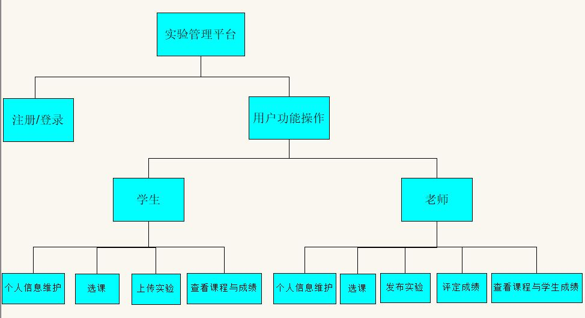

# 基于GitHub的实验管理平台的分析与设计

### 成都大学信息科学与工程学院
|    学号  |   班级    |    姓名  |   照片     |
|:--------:|:--------: | :----------: | :-------:|
|201510414430|软件(本)15-4|周威 ||

## 1. 概述
- 基于GitHub的实验管理平台的作用是在线管理学生实验的web系统，设计目的在于减轻全校教职工的实验批改负担以及方便学生提交实验，查看自己的成绩。老师发布的实验项目和学生提交的实验均显示在GitHub页面上。
- 学生的功能主要有：一是设置自己的GitHub用户名和密码，二是提交实验，三是查看自己各课程实验的成绩。学生的GitHub用户名是公开的，但成绩不公开。
- 老师的功能主要有：一是批改每个学生的实验并评分，二是查看每个学生的成绩。
- 老师和学生都能通过本系统的链接方便地跳转到对应学生的每个GitHUB课程的实验目录，以便批改实验或者查看实验情况。
- 实验成绩按数字分数计算，每项实验的满分为100分，并设置了多项评分细则，最低为0分。
- 系统自动计算每个学生每一科的所有实验的平均分。
    
## 2. 系统总体结构

首页界面设计参见：(ui/home.html)
    
## 3. 用例图设计 [源码](src/UseCase.puml)

## 4. 类图设计 [源码](src/class.puml)

## 5. 数据库设计
- ### [参见数据库设计](./数据库设计.md)

## 6. 用例及界面详细设计
- ### [“学生列表”用例](./用例/学生列表.md),[界面](https://zwdbox.github.io/is_analysis/test6/ui/index.html)
- ### [“评定成绩”用例](./用例/评定成绩.md),[界面](https://zwdbox.github.io/is_analysis/test6/ui/评定成绩.html)
- ### [“查看成绩”用例](./用例/查看成绩.md),[界面](https://zwdbox.github.io/is_analysis/test6/ui/查看成绩.html)
- ### [“修改密码”用例](./用例/修改密码.md),[界面](https://zwdbox.github.io/is_analysis/test6/ui/顶部菜单.html)
- ### [“修改用户信息”用例](./用例/修改用户信息.md),[界面](https://zwdbox.github.io/is_analysis/test6/ui/顶部菜单.html)
- ### [“查看用户信息”用例](./用例/查看用户信息.md),[界面](https://zwdbox.github.io/is_analysis/test6/ui/顶部菜单.html)
- ### [“登出”用例](./用例/登出.md),[界面](https://zwdbox.github.io/is_analysis/test6/ui/顶部菜单.html)
- ### [“登录”用例](./用例/登录.md),[界面](https://zwdbox.github.io/is_analysis/test6/ui/登录.html)
    