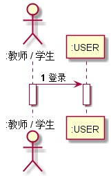

<!-- markdownlint-disable MD033-->
<!-- 禁止MD033类型的警告 https://www.npmjs.com/package/markdownlint -->

# “个人信息维护”用例 [返回](./README.md)
## 1. 用例规约

|用例名称|个人信息维护|
|-------|:-------------|
|功能|用户进行个人信息的修改如修改密码，用户名等|
|参与者|游客，学生，老师|
|前置条件|学生，老师需要先登录|
|后置条件| |
|主事件流| |
|备选事件流|系统当前访问数过高，系统提示“服务器忙，请稍后再试” |

## 2. 业务流程（顺序图） [源码](./src/gerenxinxiweihu.puml)
 

## 3. 界面设计
- 界面参照: https://zzhouwei.github.io/is_analysis/test6/ui/page_2.html
- API接口调用
    - 接口1：[setInfo](./setInfo.md) 

## 4. 算法描述
无
    
## 5. 参照表

- [USER](./数据库设计.md/#USER)

