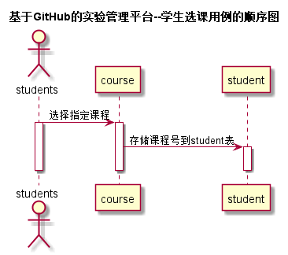

<!-- markdownlint-disable MD033-->
<!-- 禁止MD033类型的警告 https://www.npmjs.com/package/markdownlint -->

# “学生选课”用例 [返回](./README.md)
## 1. 用例规约

|用例名称|学生选课|
|-------|:-------------|
|功能|学生在线选课|
|参与者|学生|
|前置条件|学生登录|
|后置条件| |
|主事件流|1. 学生登录 2.选课与退选 |
|备选事件流||

## 2. 业务流程（顺序图） [源码](./src/xueshengxuanke.puml)
 

## 3. 界面设计
- 界面参照: https://zzhouwei.github.io/is_analysis/test6/ui/page_2.html
- API接口调用
    - 接口1：[getCourse](./getCourse.md) 
    - 接口2: [setStudentChoose](./studentchoose.md) 

## 4. 算法描述
	学生选课后将课程号+“,”后存入STUDENT表中的CURRICULA-VARIAbLE字段，其中","用来分隔不同的课程编号    
## 5. 参照表

- [COURSE](./数据库设计.md/#COURSE)
- [STUDENT](./数据库设计.md/#STUDENT)

