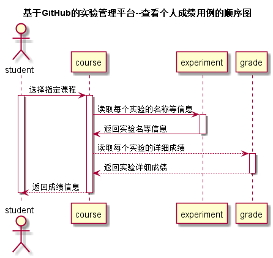

<!-- markdownlint-disable MD033-->
<!-- 禁止MD033类型的警告 https://www.npmjs.com/package/markdownlint -->

# “学生查看个人成绩”用例 [返回](./README.md)
## 1. 用例规约

|用例名称|学生查看个人成绩|
|-------|:-------------|
|功能|学生查看自己课程的每一项实验成绩|
|参与者|学生|
|前置条件|学生登录到平台|
|后置条件||
|主事件流||
|备选事件流||

## 2. 业务流程（顺序图） [源码](./src/chakangerenchengji.puml)

## 3. 界面设计
- 界面参照: https://zzhouwei.github.io/is_analysis/test6/ui/page_2.html
- API接口调用
    - 接口1：[getCourse](./getCourse.md) 
    - 接口2：[getOwnGrade](./getOwnGrade.md)

## 4. 算法描述
无
## 5. 参照表

- [USER](./数据库设计.md/#USER)

