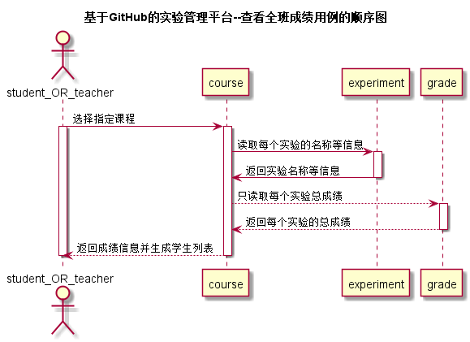

<!-- markdownlint-disable MD033-->
<!-- 禁止MD033类型的警告 https://www.npmjs.com/package/markdownlint -->

# “查看全班成绩”用例 [返回](./README.md)
## 1. 用例规约

|用例名称|查看全班成绩|
|-------|:-------------|
|功能|返回某一课程的每一个同学的每一个实验的成绩|
|参与者|学生，老师|
|前置条件|学生，老师需要先登录|
|后置条件| |
|主事件流| |
|备选事件流| |

## 2. 业务流程（顺序图） [源码](./src/chakanquanbanchengji.puml)
 

## 3. 界面设计
- 界面参照: https://zzhouwei.github.io/is_analysis/test6/ui/page_2.html
- API接口调用
    - 接口1：[getCourse](./getCourse.md) 
    - 接口2：[getClassGrade](./getClassGrade.md)
    

## 4. 算法描述
    无
    
## 5. 参照表
- [STUDENT](./数据库设计.md/#STUDENT)
- [GRADE](./数据库设计.md/#GRADE)
- [COURSE](./数据库设计.md/#COURSE)
