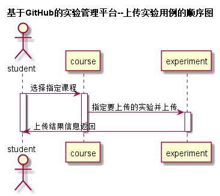

<!-- markdownlint-disable MD033-->
<!-- 禁止MD033类型的警告 https://www.npmjs.com/package/markdownlint -->

# “老师发布实验”用例 [返回](./README.md)
## 1. 用例规约

|用例名称|老师发布实验|
|-------|:-------------|
|功能|学生提交实验|
|参与者|老师|
|前置条件|老师登录|
|后置条件| |
|主事件流|1. 选择对应的课程 2.填写实验名称，目的，过程步骤，提交日期等 3.确认提交。|
|备选事件流||

## 2. 业务流程（顺序图） [源码](./src/shangchuanshiyan.puml)
 

## 3. 界面设计
- 界面参照: https://zwdbox.github.io/is_analysis/test6/ui/index.html
- API接口调用
    - 接口1：[getCourse](./getCourse.md) 
    - 接口2: [setExperiment](./setExperiment.md) 

## 4. 算法描述
	 无。
    
## 5. 参照表

- [COURSE](./数据库设计.md/#COURSE)
- [EXPERIMENT](./数据库设计.md/#EXPERIMENT)

